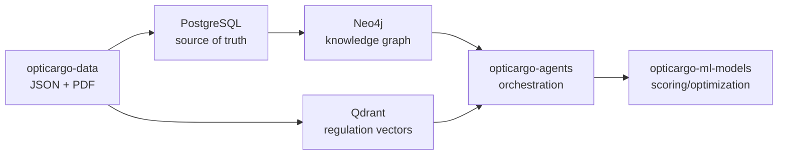

# OptiCargo Data Contract Final

Dokumen ini adalah kontrak baseline-final untuk data yang dipakai bersama oleh `opticargo-data`, `opticargo-knowledge-graph`, `opticargo-rag-pipeline`, dan `opticargo-agents`.

Tujuannya sederhana: semua repo boleh berkembang logic-nya, tetapi bentuk data inti tidak berubah tanpa koordinasi.

## Ruang Lingkup

Kontrak ini mencakup dua kelompok data:

1. Data operasional untuk PostgreSQL dan Knowledge Graph:
   - `ports`
   - `routes`
   - `ships`
   - `voyages`
   - `commodities`
   - `suppliers`
2. Data knowledge base untuk RAG:
   - `regulations.json`
   - PDF regulasi pada folder `dataset/regulations/`

## Prinsip Integrasi

- `opticargo-data` adalah sumber awal dataset dan seeding.
- PostgreSQL menjadi source of truth untuk data operasional.
- Neo4j dibentuk dari data operasional PostgreSQL, bukan langsung dari JSON.
- Qdrant dibentuk dari metadata regulasi dan PDF.
- Agents tidak membaca JSON langsung; Agents mengakses KG/RAG/ML lewat dependency interface.
- ID harus stabil dan tidak berubah karena dipakai sebagai penghubung lintas repo.

## Contract: Ports

Sumber: `dataset/ports/ports.json`

Field wajib:

| Field | Digunakan oleh | Catatan |
| --- | --- | --- |
| `id` | PostgreSQL, KG, Agents | Primary identifier |
| `name` | KG, Agents | Nama pelabuhan untuk konteks keputusan |
| `city` | KG, Agents | Lokasi administratif |
| `province` | KG, Agents | Lokasi administratif |
| `latitude` | KG, ML | Titik koordinat |
| `longitude` | KG, ML | Titik koordinat |
| `max_vessel_tonnage` | KG, ML | Constraint kapasitas kapal/pelabuhan |

## Contract: Routes

Sumber: `dataset/routes/routes.json`

Field wajib:

| Field | Digunakan oleh | Catatan |
| --- | --- | --- |
| `id` | PostgreSQL, KG | Primary identifier route |
| `origin_port_id` | PostgreSQL, KG | Harus refer ke `ports.id` |
| `destination_port_id` | PostgreSQL, KG | Harus refer ke `ports.id` |
| `distance_nm` | KG, ML, Agents | Jarak dalam nautical miles |
| `estimated_days` | ML, Agents | Estimasi waktu perjalanan |
| `route_type` | Agents | Klasifikasi rute |
| `is_active` | Agents | Filter route yang aktif |

## Contract: Ships

Sumber: `dataset/ships/ships.json`

Field wajib:

| Field | Digunakan oleh | Catatan |
| --- | --- | --- |
| `id` | PostgreSQL, KG | Primary identifier kapal |
| `name` | KG, Agents | Nama kapal |
| `ship_type` | ML, Agents | Tipe kapal |
| `status` | Agents | Filter operasional |
| `deadweight_tonnage` | ML | Kapasitas berat |
| `cargo_capacity_m3` | ML | Kapasitas volume |

## Contract: Voyages

Sumber: `dataset/voyages/voyages.json`

Field wajib:

| Field | Digunakan oleh | Catatan |
| --- | --- | --- |
| `id` | PostgreSQL, KG, Agents | Primary identifier voyage |
| `ship_id` | PostgreSQL, KG | Harus refer ke `ships.id` |
| `route_id` | PostgreSQL, KG | Harus refer ke `routes.id` |
| `departure_date` | Agents | Jadwal keberangkatan |
| `arrival_date` | Agents | Jadwal kedatangan |
| `status` | Agents | Filter voyage |
| `total_capacity_ton` | KG, ML, Agents | Kapasitas total |
| `used_capacity_ton` | KG, ML, Agents | Kapasitas terpakai |
| `remaining_capacity_ton` | KG, ML, Agents | Kapasitas tersisa |

Aturan kapasitas:

- `total_capacity_ton` harus lebih besar dari 0.
- `used_capacity_ton` tidak boleh negatif.
- `remaining_capacity_ton` tidak boleh negatif.
- `used_capacity_ton` dan `remaining_capacity_ton` tidak boleh melebihi `total_capacity_ton`.

## Contract: Commodities

Sumber: `dataset/commodities/commodities.json`

Field wajib:

| Field | Digunakan oleh | Catatan |
| --- | --- | --- |
| `id` | PostgreSQL, KG, Agents | Primary identifier komoditas |
| `name` | KG, Agents | Nama komoditas |
| `category` | Agents | Kategori komoditas |
| `hs_code` | RAG/Agents | Referensi perdagangan |
| `special_requirements` | Agents, ML | Constraint handling |

## Contract: Suppliers

Sumber: `dataset/suppliers/suppliers.json`

Field wajib:

| Field | Digunakan oleh | Catatan |
| --- | --- | --- |
| `id` | PostgreSQL, KG, Agents | Primary identifier supplier |
| `business_name` | KG, Agents | Nama bisnis |
| `port_id` | PostgreSQL, KG | Harus refer ke `ports.id` |
| `commodity_ids` | PostgreSQL, KG | Harus refer ke `commodities.id` |
| `avg_monthly_volume_ton` | KG, ML, Agents | Indikasi supply tersedia |
| `rating` | Agents, ML | Sinyal kualitas supplier, range 0-5 |
| `verified` | Agents | Filter kepercayaan |

## Contract: Regulations

Sumber:

- `dataset/regulations/regulations.json`
- `dataset/regulations/*.pdf`

Field wajib:

| Field | Digunakan oleh | Catatan |
| --- | --- | --- |
| `id` | RAG, Agents | ID dokumen sumber |
| `filename` | RAG | Harus ada sebagai PDF di folder regulations |
| `title` | RAG, Agents | Judul pendek |
| `full_title` | RAG, Agents | Judul lengkap untuk citation |
| `document_type` | RAG | Tipe dokumen |
| `issuer` | RAG, Agents | Penerbit dokumen |
| `year` | RAG, Agents | Tahun regulasi |
| `topics` | RAG | Minimal satu topik |
| `rag_priority` | RAG | Prioritas indexing/retrieval |
| `status` | RAG, Agents | Status dokumen |

Aturan RAG:

- Setiap `filename` harus menunjuk PDF yang ada dan tidak kosong.
- `topics` harus berupa list dan minimal berisi satu item.
- Metadata chunk di Qdrant harus tetap membawa `document_id`, `source_document_id`, `chunk_id`, `title`, `full_title`, `page`, `checksum`, `document_version`, dan `chunk_text`.

## Alur Integrasi Final



## Validasi Wajib Sebelum Integrasi

Jalankan dari root `opticargo-data`:

```powershell
python -m unittest tests.test_dataset_integrity
python -m seed.validate
```

Catatan: `seed.validate` membutuhkan package `opticargo-shared` dan dependency Python seperti `pydantic` sudah tersedia di environment aktif. Jika menjalankan dari repo `opticargo-data` secara lokal, pastikan `opticargo-shared` sudah ter-install atau `PYTHONPATH` diarahkan ke `opticargo-shared/src`.

Validasi ini memastikan:

- ID unik di masing-masing dataset utama.
- Relasi `route -> port`, `voyage -> ship/route`, dan `supplier -> port/commodity` valid.
- Field wajib untuk Agents, KG, ML, dan RAG tersedia.
- PDF regulasi lengkap dan siap diproses RAG.
- Dataset memiliki minimal satu skenario backhaul candidate yang dapat dipakai untuk smoke test Agents.

## Catatan Perubahan Kontrak

Jika ada field yang ingin dihapus, diganti nama, atau diubah tipenya:

1. Update dokumen ini.
2. Update test kontrak data.
3. Sinkronkan perubahan dengan `opticargo-shared`.
4. Update seeder PostgreSQL/Neo4j/Qdrant.
5. Update client/dependency interface di `opticargo-agents`.
